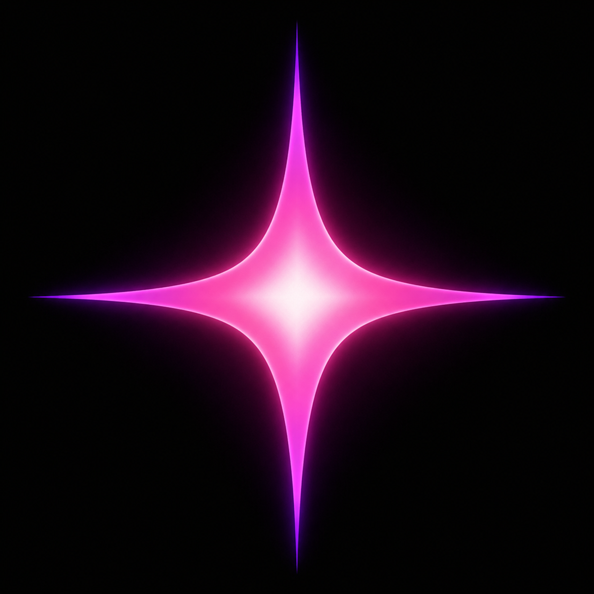
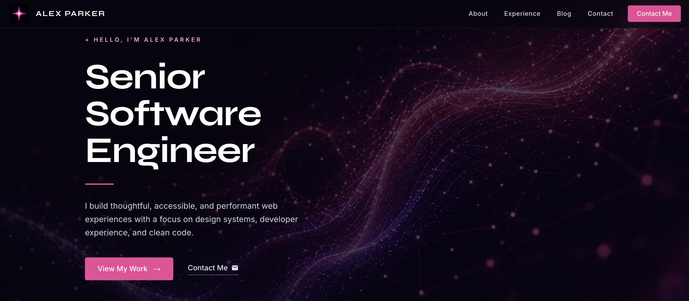

<div align="center">
  

  # Aurora

  **A deep, atmospheric portfolio template for engineers and creators — built under a night sky.**

  Built with Next.js 16 · React 19 · Material UI 9 · TypeScript

  [](https://nextjs.org)
  [](https://react.dev)
  [](https://mui.com)
  [](https://www.typescriptlang.org)

</div>

---

## Preview



---

## What's included

- **Hero** — headline, subhead, and social links
- **About** — personal bio and summary
- **Experience** — chronological work history with company, role, and highlights
- **Blog** — card grid of articles with individual post pages at `/blog/[slug]`
- **Contact** — inbound contact form
- **Scroll animations** — CSS-driven reveal system via Intersection Observer, no animation library required
- **SEO-ready** — server-side rendering, Metadata API, statically generated blog pages, optimized images

---

## Design

Aurora draws its palette and mood from the night sky — deep violet shadows, rose-pink light, and the kind of atmosphere that makes you feel like you're reading under the stars. The aesthetic is intentional:

- **Night-sky color palette** — near-black backgrounds (`#0c0819`) layered with deep plum and violet, with rose-pink as the single accent that pulls the eye
- **Living ambient layer** — gradient auras drift behind the content with a subtle parallax on scroll, evoking the slow movement of auroral light
- **Particle constellation** — a canvas-drawn field of drifting dots that connect into transient constellations, never distracting, always present
- **Cursor glow** — a soft radial bloom follows the pointer on desktop, making the page feel responsive to presence
- **Botanical detail** — faint SVG sprigs sway at the edges of the viewport, grounding the cosmic palette in something delicate and organic
- **Motion-aware** — every animation respects `prefers-reduced-motion`; the page is calm for users who need it
- **Typographic contrast** — Space Grotesk at display weight for headlines, Inter for everything else; tight letter-spacing on `h1` keeps it sharp at large sizes

---

## Tech stack

| Layer | Technology |
|---|---|
| Framework | Next.js 16 (App Router) |
| UI | Material UI 9 + Emotion |
| Language | TypeScript 5 |
| Fonts | Space Grotesk + Inter via `next/font` |
| Runtime | React 19 |

---

## Getting started

```bash
npm install
npm run dev
```

Open [http://localhost:3000](http://localhost:3000).

---

## Customization

All content lives in one file:

**`app/helpers/config.ts`**

```ts
export const social = [...]      // GitHub, LinkedIn, X
export const experience = [...]  // Work history
export const blogPosts = [...]   // Blog post metadata
export const education = [...]   // Education
```

The theme — colors, typography, dark mode — is in **`app/theme.ts`**.

---

## Project structure

```
app/
├── blog/[slug]/         # Dynamic blog post pages
├── components/          # All UI sections and layout components
├── helpers/config.ts    # Site content (single source of truth)
├── theme.ts             # MUI theme
├── globals.css          # Global styles + .reveal animation
├── layout.tsx           # Root layout with metadata
└── page.tsx             # Home page
```

---

## Deployment

```bash
npx vercel
```

All blog pages are pre-rendered at build time — fast, CDN-friendly, no runtime overhead.

---

## Scripts

| Command | Description |
|---|---|
| `npm run dev` | Start development server |
| `npm run build` | Production build |
| `npm run start` | Serve production build locally |
| `npm run lint` | Run ESLint |
